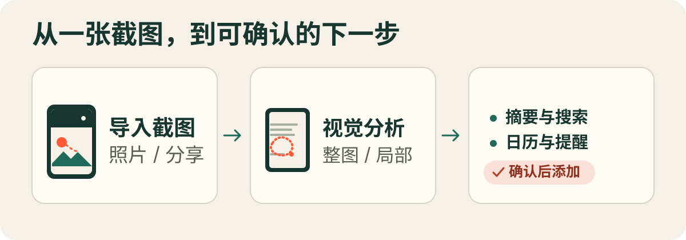

# Glance

**把截图里的信息，变成下一步行动。**

Glance 是一款面向 iPhone 和 iPad 的截图理解应用。你可以从照片图库选择截图，或从其他 App 的分享菜单发送图片；Glance 会调用你配置的视觉 AI 服务生成摘要与操作建议。需要聚焦细节时，可以圈选截图局部重新分析，或针对整张图、当前区域提问。

<p align="center">
  
</p>

> **使用前请注意：**Glance 不内置 AI 服务或 API 密钥。图片会发送给你配置的服务；提问功能不执行联网检索。搜索建议会打开外部搜索引擎，日历事件和提醒只会在你确认后添加。

## 快速开始

### 环境要求

- iOS / iPadOS 26 或更新版本
- 支持 iOS 26 SDK 的 Xcode
- 支持图片输入的 OpenAI-compatible Chat Completions 服务及其 API 密钥

### 构建并运行

1. 克隆仓库并打开 Xcode 项目：

   ```sh
   git clone https://github.com/KryptonGao/Glance.git
   cd Glance
   open Glance.xcodeproj
   ```

2. 选择 `Glance` scheme，在 **Signing & Capabilities** 中为 `Glance` 和 `GlanceShare` 配置开发团队，然后在模拟器或设备上构建并运行。

   也可以构建模拟器版本：

   ```sh
   xcodebuild -project Glance.xcodeproj \
     -scheme Glance \
     -destination 'generic/platform=iOS Simulator' \
     build
   ```

### 配置 AI 服务并分析截图

首次启动后，打开右上角的 **AI Provider** 设置，填写服务信息并保存。服务必须支持视觉输入和 OpenAI-compatible 图片消息格式。

| 字段 | 说明 | 示例 |
| --- | --- | --- |
| Name | 仅用于识别服务 | `OpenAI` |
| Base URL | API 基础地址 | `https://api.openai.com/v1` |
| Model ID | 支持图片输入的模型 ID | `gpt-4o` |
| API Key | 服务商签发的密钥 | 由服务商提供 |
| Search engine | 搜索建议使用的引擎 | Google、Bing 或 DuckDuckGo |

Glance 会向 Base URL 的 `/chat/completions` 端点发送请求；也可以直接填写完整端点。保存后可点 **Test Connection** 检查连接。配置完成后，从首页选择一张截图，或在其他 App 中通过分享菜单将单张图片发送给 Glance。

## 功能

- **摘要与建议**：读取截图内容并生成简短摘要；在合适时提供搜索建议、日历事件或提醒。
- **圈选局部分析**：手绘圈出关注区域；发送给模型前会遮罩选区外的像素。局部结果与整图结果分开保存，可撤销或重画选区。
- **针对截图提问**：可围绕整张截图或当前分析区域提问；该功能本身不会联网检索，也不保留多轮对话上下文。
- **确认后执行**：搜索建议会打开所选搜索引擎；添加日历事件或提醒前，你可以检查并确认。
- **本机历史记录**：查看、重新打开或删除已分析的截图及结果。历史记录保存在设备的共享容器中，供 App 与分享扩展使用。

模型对截图内容的识别结果取决于你配置的服务，可能不准确；请在执行建议前核对信息。

## 隐私与数据

- 整图分析和提问会将对应图片发送至你配置的 AI 服务。请查看该服务的隐私政策及数据处理条款。
- 局部分析和针对局部的提问会在发送前遮罩选区以外的像素；选区内的图像仍会发送给 AI 服务。
- API Key 存储在 iOS Keychain；服务配置、历史记录和图片保存在 App Group 容器中。本项目本身不提供账号或云端存储服务。
- 日历和提醒权限仅用于你确认添加对应操作时；Glance 不会在确认前创建事件或提醒。

## 开发签名与共享容器

主 App 和 Share Extension 通过 App Group 共享服务配置、API Key 访问权限及历史记录。使用自己的 Apple Developer Team 签名运行时，需要在两个 target 上启用相同的 App Group 和 Keychain Sharing，并确保它们与代码中的标识符一致：

- App Group：`group.space.chenkai.glance`，见 `Shared/GlanceStorage.swift` 与两个 entitlements 文件。
- Keychain access group：当前值见 `Shared/GlanceStorage.swift` 中的 `GlanceConstants.keychainAccessGroup` 与两个 entitlements 文件；更换团队时要同步更新代码中的团队前缀及 entitlements 配置。
- 默认 Bundle ID：`space.chenkai.glance`（主 App）和 `space.chenkai.glance.share`（Share Extension），可在 Xcode target 的构建设置中调整。

这些标识符必须属于你的开发团队，并在主 App、扩展及代码配置之间保持一致。更换 App Group 或 Keychain access group 时，请同步更新上述位置后重新签名构建。

## 项目结构

```text
Glance/             主 App 界面与历史记录
GlanceShare/        iOS 分享扩展
Shared/             分析界面、AI 接口、局部选区及共享存储
docs/               产品需求草案
assets/readme/      README 流程图
Glance.xcodeproj/   Xcode 项目和 Glance scheme
```

`docs/screenshot-analysis-prd.md` 是需求草案，包含尚未实现的设想；请以应用当前功能为准。

## License

[Apache License 2.0](./LICENSE)
